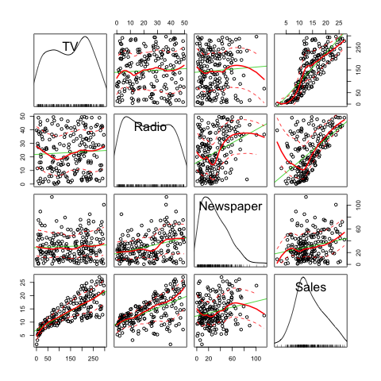
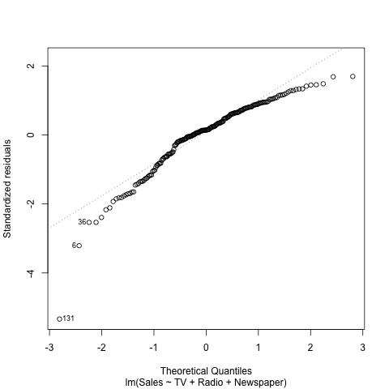
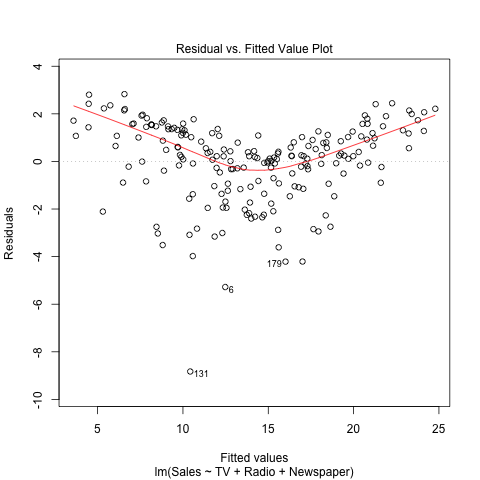

## Abstract
This report aims to reproduce the main results displayed in **section 3.2: Multiple Linear Regression** of the book **_An Introduction to Statistical Learning_** and perform simple linear regression analysis on the data set `Advertising`.

## Introduction
According to the book, the overall goal is to provide advice on how to improve sales of the particular product. More specifically, the idea is to determine whether there is an association between advertising and sales, and if so, develop an accurate model that can be used to predict sales on the basis of the three media budgets. Rather than comparing variables separately, we fit a multiple linear regression model, as discussed in the methodology part to analyze such association.


## Data
We download the data set `Advertising`, which is provided by the author of the book. This data set has four variables: `TV`, `Radio`, `Newspaper`, and `Sales`. It consists of the Sales (in thousands of units) of a particular product in 200 different markets, along with advertising budgets (in thousands of dollars) for the product in each of those markets for three different media: TV, Radio, and Newspaper.

## Methology
In this paper, we mainly consider the relatinoship between Sales versus **TV**, **Radio** and **Newspaper**. In order to explore this multiple variable relationship, we use a multiple linear model and regress `sales` onto `TV`, `Radio`, `Newspaper` by fitting the model:

$$Sales = \beta_{0} + \beta_{1} TV + \beta_{2} Radio + \beta_{3} Newspaper $$

Mathematically, $\beta_0$ represents the intercept and $\beta_1$ to $\beta_3$ represents the slope terms in the linear model.
With this linear model, we estimate the coefficients by minimizing the least squares criterion, which is minimizing the sum of squared errors.

## Results

First, for the sake of comparison, we want to first put out the coefficients estimates of simple regression models: `Sales` on `TV`, `Sales` on `Radio`, and `Sales` on `Newspaper`. 

#### Table 1: Simple Linear Regression on TV and Sales

```{r, results='asis', echo=FALSE, message=FALSE}
# Load data into report
library(xtable)
advertising = read.csv("../data/Advertising.csv", header = TRUE)
simple_lm <- lm(Sales ~ TV, data = advertising)
simple_summary <- summary(simple_lm)
print(xtable(simple_summary$coefficient, caption = 'Simple Linear Regression on TV and Sales'), comment = FALSE, caption.placement = 'top')
cat("\n")
```

#### Table 2: Simple Linear Regression on Radio and Sales

```{r, results='asis', echo=FALSE, message=FALSE}
simple_lm <- lm(Sales ~ Radio, data = advertising)
simple_summary <- summary(simple_lm)
print(xtable(simple_summary$coefficient, caption = 'Simple Linear Regression on Radio and Sales'), comment = FALSE, caption.placement = 'top')
cat("\n")
```


#### Table 3: Simple Linear Regression on Newspaper and Sales

```{r, results='asis', echo=FALSE, message=FALSE}
simple_lm <- lm(Sales ~ Newspaper, data = advertising)
simple_summary <- summary(simple_lm)
print(xtable(simple_summary$coefficient, caption = 'Simple Linear Regression on Newspaper and Sales'), comment = FALSE, caption.placement = 'top')
cat("\n")
```


Now, with the least square estimators, we compute the multiple linear regression coefficients:


#### Table 4: Information about Regression Coefficients

```{r, results='asis', echo=FALSE, message=FALSE}
# Load data into report
load("../data/regression.RData")
load("../data/correlation-matrix.RData")
print(xtable(summary$coefficient, caption = 'Multiple Linear Regression Coefficients'), comment = FALSE, caption.placement = 'top')
```

For the Advertising data, least squares coefficient estimates of the multiple linear regression of number of units sold on radio, TV, and newspaper advertising budgets.

Some reflections we can make on this table is looking at the estimates. It seems that `TV` and `Radio` both have positive impact on the sales, while `Newspaper` has negative impact. When we compare TV and Radio, since 0.05 < 0.19, `Radio` seems to have a higher influence on sales. Therefore, we can reach the conclusion that not all predictors help to explain the response. When `Radio` may potentially indicate the usefulness and responsiveness of costumers on sales, the other two variables do not show significant impact.

From my perspective, the linear model to some extent does not fit the data well. When we take a closer look at the individual scatterplots, we could hardly see strong linear relationship as most of the points, esepcially in newspaper, are just randomly spreading out. Therefore, even though we fit correctly the linear model, the predictions will not be as accurate as we imagine it to be.


**More information about the least squares model is given in the table below:**

#### Table 5: Correlation Matrix

```{r, results='asis', echo=FALSE, message=FALSE}
print(xtable(cor_m, caption = 'Correlations Matrix'), comment = FALSE, caption.placement = 'top')
```

Table 5 indicates correlation matrix for TV, radio, newspaper, and sales for the Advertising data.


#### Table 6: Regression Quality Indices

```{r}
#source('../code/functions/regression-functions.R')
#RSE = residual_std_error(lm_ad)
#R_square = r_squared(lm_ad)
#f_statistic = f_statistic(lm_ad)

#df = data.frame(Quantity= c("Residual Standard Error", "R-squared", "F-statistic"), Value = c(RSE, R_square, f_statistic))
#print(xtable(df, caption = 'Regression Quality Indices'), comment = FALSE, include.rownames=FALSE, caption.placement = 'top')
```


Here are some sample images relating Advertising dataset








## Conclusions
To conclude, I explored the linear relationship between TV, Radio and Newspapers versus Sales, fitting a multiple linear regression model upon the advertising data to understand the information hidden in the data. From the reproduced graph we can see the same results as produced in the book, namely "a linear fit captures the essence of the relationship, although it is somewhat deficient in the left of the plot." This project helps us to fully understand the multiple linear regression model, its mathematical interpretation, and all the data retrieved from the R fitted linear model. It also gives us great insights in the reproducible project, and in specific, how important it is to be able to reproduce other people's work.


